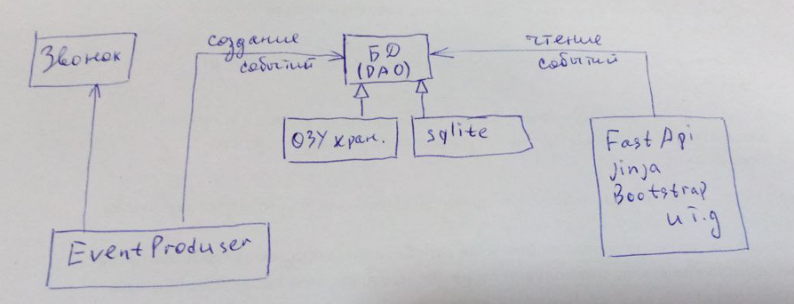
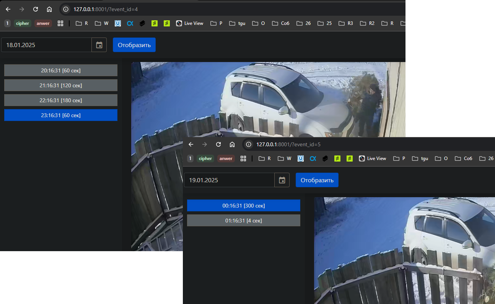

### Дверной звонок

* смотрит через камеру в заданную область, ищет людей
* при нахождении 
  * создает запись в хранилище
  * воспроизводит звук
  * продолжает следить за человеком, обновляя длительность пребывания в целевой зоне
* пользователь имеет доступ к сайту только на чтение

### Архитектура
Система условно делится на 2 части (создание событий+звонок и просмотр событий)
- Теоритически подсистема мониторинга может работать без БД и интерфейска
- Как и подсистема просмотра может подключиться к БД и просматривать старые события



#### Мониторинг
За мониторинг отвечает служба EventProducerService (файл ./human_detection_service.py)
Используется библиотека opencv
При возникновении события служба воспроизводит звук и отправляем событие в
одну из реализаций AbstractEventStore

Для того, чтобы не нагружать ЦП поиск происходит не на всем изображении, а
на определенной его части **model/search_area.py**

#### Используемые паттерны
* Data Access Object - **dao/**
* Data Transfer Object - **rest_model/bell_event_dto.py**
* Factory Method - **app.py**
* Pure Fabrication - **utils/date_utils.py**

#### Хранение данных
На данный момент есть одна реализация хранилища данных InMemoryEventStore
События хранятся внутри pd.DataFrame. 
Подсистема pandas инкапсулирована внутри InMemoryEventStore для того чтобы 
в будущем можно было добавить реализацию sqlite

#### Тесты
В некоторых файлах добавлены небольшие юнит-тесты
Также есть один интеграционный тест для отладки поиска человека в видеопотоке 
**test/get_human_test.py**

### Отображение данных
Верстка минималистичная на основе Bootstrap5
Слева вверху есть datepicker 
Далее списком отображаются события за сутки


### Запуск
* В тестовом режиме
    * в качестве источника данных будет использоваться файл **resources/test_video.mp4** 
    * хранение списка событий будет в ОЗУ
    * хранение изображение в директории **resources/event-images**
    * в момент запуска будет подгружено 5 фиктивных событий + 1 от тестового видео
* В нормальном режиме
  * источник данных - rtsp поток с системы видеонаблюдения
  * хранение данных в БД (не реализовано, пока в ОЗУ)
  * хранение изображений тоже в БД, чтобы не нагружать файловую систему большим количеством маленьких файлов
Настройка в каком режиме запускать делается путем редактирования файла <mark>config.py</mark>
 ```sh
 uvicorn app:app --reload
 ```

#### Литература
https://www.tutorialspoint.com/how-to-detect-humans-in-an-image-in-opencv-python
https://dev.to/atatanasov/bootstrap-5-datepicker-i9c?ysclid=m53neczxnt329727639